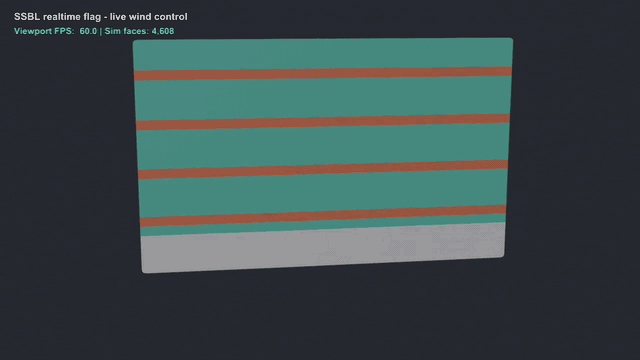
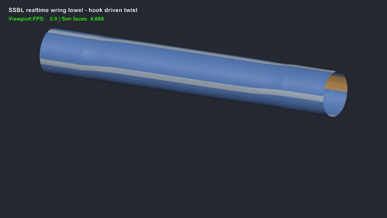
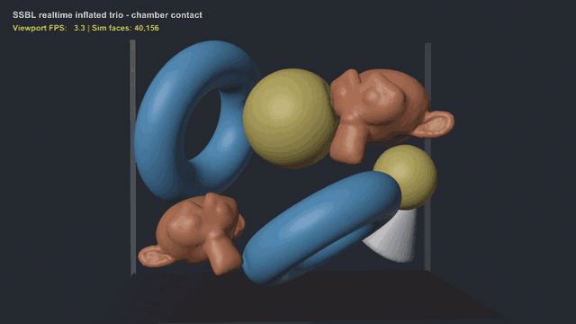
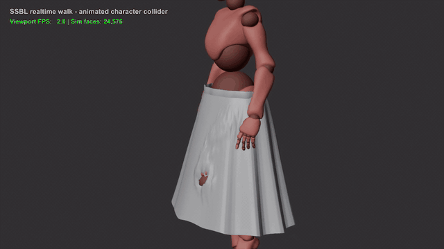
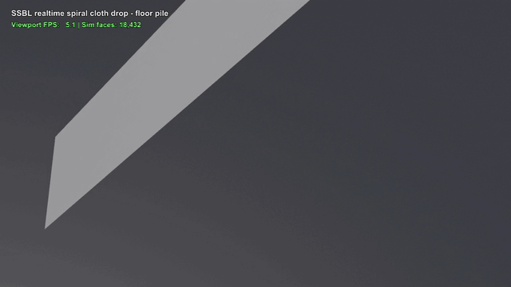

# SSBL CUDA XPBD

SSBL CUDA XPBD is a native CUDA XPBD cloth add-on for Blender 5.0. It provides realtime viewport cloth preview and can bake simulation results to PC2 point-cache files.

SSBL CUDA XPBD 是一个面向 Blender 5.0 的本地 CUDA XPBD 布料插件，支持视口实时布料预览，并可将模拟结果烘焙为 PC2 点缓存。

## Download

- Direct download / 直接下载: [`ssbl-official.zip`](https://github.com/devin22ldh-afk/ssbl-cuda-xpbd/releases/download/v0.4.3/ssbl-official.zip)
- Release page / 发布页面: [v0.4.3](https://github.com/devin22ldh-afk/ssbl-cuda-xpbd/releases/tag/v0.4.3)

## Features / 主要功能

- Real-time cloth preview / 实时布料预览: play the Blender timeline to drive XPBD cloth simulation in the viewport.
- Timeline integration / 时间轴集成: preview sessions stay in sync with playback, frame changes, and playback stop events.
- PC2 baking / PC2 缓存烘焙: write simulation output to `ssbl_cache/<object>_xpbd.pc2` and bind it through a Mesh Cache modifier.
- Collision support / 碰撞支持: use a ground plane, sphere collider, static collider collections, and CUDA static SDF collision.
- Self collision / 自碰撞: switch between `fast` preview-first mode and `strict` quality-first mode.
- Multi-cloth preview / 多布料预览: solve multiple cloth objects together with cross-cloth dynamic collision and collision layers.
- Material and constraints / 材质与约束: tune hardness, cloth thickness, density, damping, contact friction, weighted pin vertex groups, and volume pressure.
- Blender force fields / Blender 力场: sample force-field collections and upload them to the native solver with per-type weights.
- Native backend / Native 后端: use the ABI41 CUDA solver at `native/bin/ssbl_xpbd_cuda_abi41.dll`.

## Demo GIFs / 演示 GIF

### 1. Brand Flag Wind


### 2. Wring Towel


### 3. Clothesline Multicloth


### 4. Walk Dynamic Collider


### 5. Spiral Cloth Drop


## Requirements / 环境要求

- Blender 5.0.
- Windows.
- NVIDIA GPU with a CUDA-capable driver. / NVIDIA GPU 和支持 CUDA 的显卡驱动。
- A prebuilt or locally built ABI41 native DLL at `native/bin/ssbl_xpbd_cuda_abi41.dll`. / 已存在或可构建的 ABI41 native DLL：`native/bin/ssbl_xpbd_cuda_abi41.dll`。
- To rebuild the native backend, install CUDA Toolkit 12.6+, Visual Studio Build Tools 2022 with the x64 C++ toolchain, and CMake 3.25+. / 如果需要重新构建 native 后端，还需要 CUDA Toolkit 12.6+、Visual Studio Build Tools 2022 x64 C++ 工具链和 CMake 3.25+。

## Installation / 安装

### Quick Zip Install / Zip 快速安装

- Download `ssbl-official.zip`. / 下载 `ssbl-official.zip`。
- In Blender, open `Edit > Preferences > Add-ons > Install from Disk...`, install the zip, and enable `SSBL CUDA XPBD`. / 在 Blender 中打开 `Edit > Preferences > Add-ons > Install from Disk...`，安装 zip 并启用 `SSBL CUDA XPBD`。

### From Source Checkout / 从源码目录安装

Place this directory in the Blender 5.0 user add-ons folder and keep the directory name as `ssbl`.

将本目录放到 Blender 5.0 的用户插件目录，并确保目录名保持为 `ssbl`。

```powershell
$addons = "$env:APPDATA\Blender Foundation\Blender\5.0\scripts\addons"
Copy-Item -Recurse -LiteralPath "C:\path\to\ssbl" -Destination "$addons\ssbl"
```

Then enable the add-on in Blender:

然后在 Blender 中启用插件：

1. Open `Edit > Preferences > Add-ons`. / 打开 `Edit > Preferences > Add-ons`。
2. Search for `SSBL CUDA XPBD`. / 搜索 `SSBL CUDA XPBD`。
3. Enable the add-on. / 勾选启用插件。

## Quick Start / 快速上手

1. Select a Mesh object in the scene. / 在场景中选择一个 Mesh 对象。
2. Open `Properties > Physics > SSBL CUDA XPBD`. / 打开 `Properties > Physics > SSBL CUDA XPBD`。
3. Turn on `Enable SSBL Cloth Simulation`. / 启用 `Enable SSBL Cloth Simulation`。
4. Optional: create a vertex group named `ssbl_pin` to pin cloth vertices. Effective pin weights below `0.05` are treated as unpinned by the native solver. / 可选：创建名为 `ssbl_pin` 的顶点组来固定布料顶点；native 解算器会把低于 `0.05` 的有效 pin 权重视为未固定。
5. Tune `Physics & Material`, `Environment & Collision`, `Force Fields`, `Solver Tuning`, and `Cache & Bake` as needed. / 按需调整 `Physics & Material`、`Environment & Collision`、`Force Fields`、`Solver Tuning` 和 `Cache & Bake`。
6. Play the Blender timeline to update the cloth preview in the viewport. / 播放 Blender 时间轴，在视口中更新布料预览。
7. Set the frame range in `Cache & Bake` and run Bake to write the PC2 cache. / 在 `Cache & Bake` 中设置起止帧并执行 Bake，写入 PC2 缓存。

## Native CUDA Backend / Native CUDA 后端

The add-on loads this DLL by default:

插件默认加载以下 DLL：

```text
native/bin/ssbl_xpbd_cuda_abi41.dll
```

If the DLL is missing, the add-on reports that the native CUDA solver is unavailable. See `native/README.md` for build details.

如果 DLL 缺失，插件会报告 native CUDA solver 不可用。更多构建说明见 `native/README.md`。

Check the build toolchain:

检查工具链：

```powershell
Push-Location .\native
.\check_toolchain.ps1
Pop-Location
```

Build the ABI41 backend and run the native smoke check:

构建 ABI41 后端并运行 native smoke：

```powershell
Push-Location .\native
.\build_recon.ps1
Pop-Location
```

To load another ABI41-compatible DLL:

如需指定其他 ABI41 兼容 DLL：

```powershell
$env:SSBL_NATIVE_DLL_PATH = "C:\path\to\ssbl_xpbd_cuda_abi41.dll"
```

## Validation / 验证

Run these commands from the add-on root. Adjust the `blender.exe` path for your machine.

以下命令应在插件根目录运行，请根据本机安装位置调整 `blender.exe` 路径。

```powershell
& "C:\Program Files\Blender Foundation\Blender 5.0\blender.exe" --background --python ".\tools\animated_inputs_smoke.py"
```

On success, this prints `SSBL_ANIMATED_INPUTS_SMOKE` and validates animated inputs, pin attachments, preview, PC2 baking, and cache cleanup.

成功时会打印 `SSBL_ANIMATED_INPUTS_SMOKE`，并验证动画输入、pin 附着、预览、PC2 烘焙和缓存清理。

```powershell
& "C:\Program Files\Blender Foundation\Blender 5.0\blender.exe" --background --python ".\tools\benchmark_v2_multicloth.py"
```

On success, this prints `SSBL_V2_BENCHMARK` and covers 10k cloth, self collision, multi-cloth, and static collider collection scenarios.

成功时会打印 `SSBL_V2_BENCHMARK`，并覆盖 10k 布料、自碰撞、多布料和静态碰撞集合场景。

```powershell
& "C:\Program Files\Blender Foundation\Blender 5.0\blender.exe" --background --python ".\tools\object_collision_smoke.py"
```

On success, this prints `SSBL_OBJECT_COLLISION_SMOKE` and validates analytic ground and wall contacts, static SDF cases, static collider updates, and friction behavior. To run a shorter local subset, set `SSBL_OBJECT_COLLISION_CASES` to a comma-separated list such as `ground,wall,static_mesh,moving_static_mesh`.

成功时会打印 `SSBL_OBJECT_COLLISION_SMOKE`，并验证解析地面和墙体接触、静态 SDF、静态碰撞体更新和摩擦行为。如需缩短本地检查，可将 `SSBL_OBJECT_COLLISION_CASES` 设为逗号分隔的子集，例如 `ground,wall,static_mesh,moving_static_mesh`。

```powershell
& "C:\Program Files\Blender Foundation\Blender 5.0\blender.exe" --background --python ".\tools\native_contact_group_probe.py" -- --case analytic_ground
& "C:\Program Files\Blender Foundation\Blender 5.0\blender.exe" --background --python ".\tools\native_contact_group_probe.py" -- --case self_vv
```

On success, each probe prints `SSBL_NATIVE_CONTACT_GROUP_PROBE`. Available cases are `analytic_ground`, `analytic_wall`, `analytic_sphere`, `analytic_corner`, `static_sdf`, and `self_vv`.

成功时每个 probe 会打印 `SSBL_NATIVE_CONTACT_GROUP_PROBE`。可用 case 包括 `analytic_ground`、`analytic_wall`、`analytic_sphere`、`analytic_corner`、`static_sdf` 和 `self_vv`。

Run the native backend smoke through:

运行 native 后端 smoke：

```powershell
Push-Location .\native
.\build_recon.ps1
Pop-Location
```

Successful output should include `SSBL_ABI41_NATIVE_OK`, `SSBL_ABI41_STATIC_SDF_OK`, and `SSBL_ABI41_PIN_WEIGHT_OK`.

成功输出应包含 `SSBL_ABI41_NATIVE_OK`、`SSBL_ABI41_STATIC_SDF_OK` 和 `SSBL_ABI41_PIN_WEIGHT_OK`。

## Troubleshooting / 常见问题

### Missing CUDA DLL / 缺少 CUDA DLL

Make sure `native/bin/ssbl_xpbd_cuda_abi41.dll` exists. You can also point `SSBL_NATIVE_DLL_PATH` at another ABI41-compatible DLL.

确认 `native/bin/ssbl_xpbd_cuda_abi41.dll` 存在。也可以通过 `SSBL_NATIVE_DLL_PATH` 指向其他 ABI41 兼容 DLL。

### Toolchain Check Fails / 工具链检查失败

Run `native/check_toolchain.ps1`. If `nvcc`, `cl`, or `cmake` is missing, install CUDA Toolkit 12.6+, Visual Studio Build Tools 2022 with the x64 C++ toolchain, and CMake 3.25+.

运行 `native/check_toolchain.ps1`。如果缺少 `nvcc`、`cl` 或 `cmake`，请安装 CUDA Toolkit 12.6+、Visual Studio Build Tools 2022 x64 C++ 工具链和 CMake 3.25+。

### Panel Is Not Visible / 看不到面板

Select a Mesh object first. The SSBL panel is under `Properties > Physics > SSBL CUDA XPBD` and is shown only when the active object is a Mesh.

先选择一个 Mesh 对象。SSBL 面板位于 `Properties > Physics > SSBL CUDA XPBD`，并且只在活动对象是 Mesh 时显示。

### Pin Vertex Group Does Not Work / Pin 顶点组不起作用

The default pin vertex group is `ssbl_pin`. If you use another name, set it in `Physics & Material`. Effective pin weights below `0.05` are treated as unpinned, while `0.75` or higher usually behaves like a hard pin.

默认 pin 顶点组名为 `ssbl_pin`。如果使用其他名称，请在 `Physics & Material` 中设置对应顶点组。低于 `0.05` 的有效 pin 权重会被视为未固定，而 `0.75` 或更高通常接近硬 pin 行为。

### Self Collision Is Slow / 自碰撞较慢

Use `fast` mode for viewport preview first. Switch to `strict` only when you need higher quality or stricter intersection prevention. Higher vertex counts, self collision, multi-cloth collision, and static SDF all increase compute cost.

优先使用 `fast` 模式进行视口预览。只有在需要更高质量或更严格避免相交时再切换到 `strict`。更高的顶点数、启用自碰撞、多布料碰撞和静态 SDF 都会提高计算成本。

## Project Layout / 项目结构

```text
__init__.py          Blender add-on registration and settings
ui.py               Physics panel UI
operators.py        Preview, reset, bake, and cache operators
solver.py           Public solver facade
session_manager.py  Preview and bake session orchestration
xpbd_core.py        Cloth build data and XPBD settings helpers
collision.py        Static collider collection helpers
force_fields.py     Blender force-field sampling
native_backend.py   ctypes bridge to the CUDA DLL
parameters.md       User-facing guide for visible SSBL panel parameters
native/             CUDA source, ABI headers, build scripts, native README
tools/              Smoke tests, benchmarks, and preview recording scripts
translation/        Blender translation resources for Chinese UI text
```

## Contributors / 贡献者

- [@devin22ldh-afk](https://github.com/devin22ldh-afk) — maintainer, core development, and releases. / 维护者、核心开发与版本发布。
- Codex — AI-assisted contributor. / AI 辅助贡献者。

## License

This project is licensed under `GPL-3.0-or-later`. See [`LICENSE`](LICENSE).
