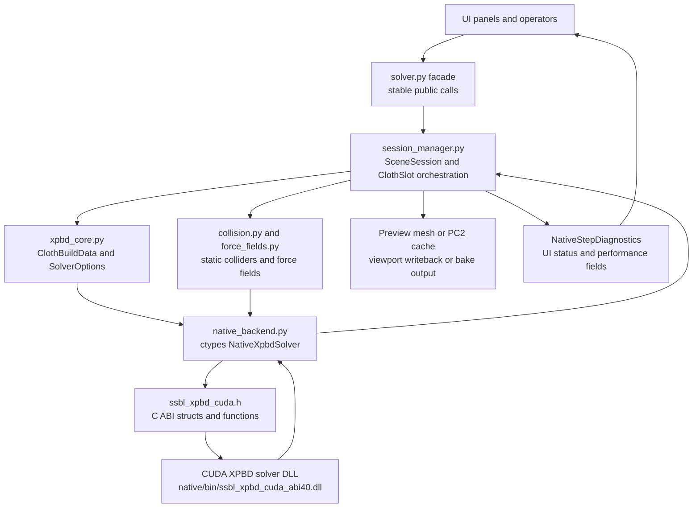
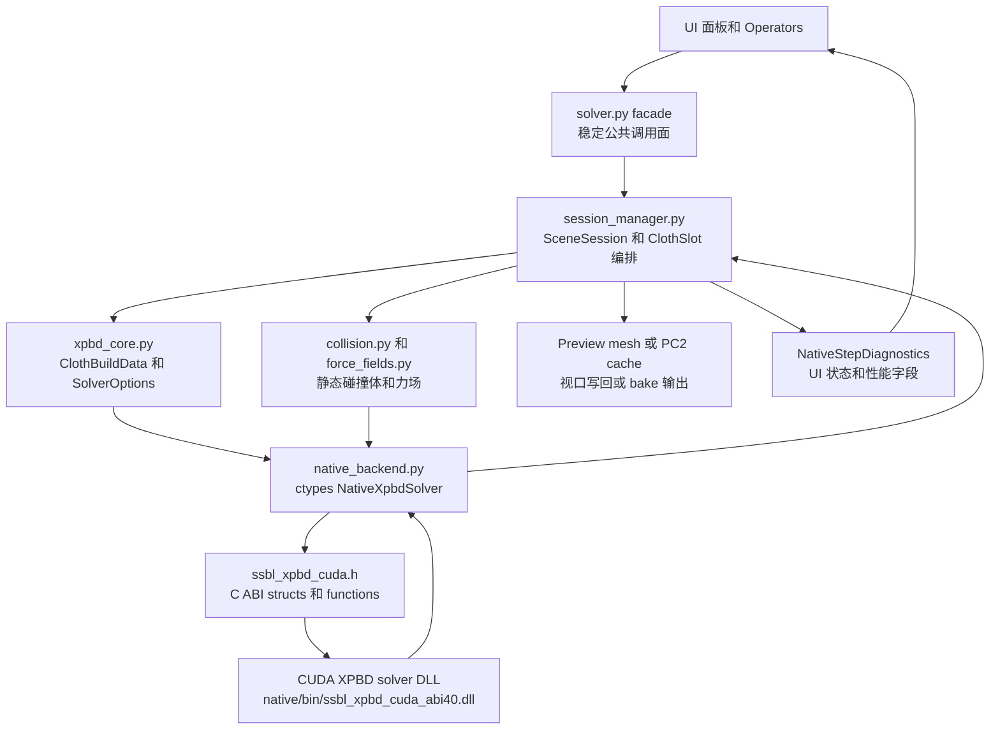

# SSBL Solver Architecture

This document explains the SSBL Blender add-on solver path from UI and operators to Python session orchestration, then through the ctypes ABI into the CUDA XPBD native solver. It is intended for maintainers who need to debug solver behavior, collision, performance, diagnostics, or native ABI changes.

This is documentation only. It does not change any public API, Python code, CUDA code, Blender registration behavior, or runtime behavior.

## Scope

`solver.py` is the stable facade that higher-level callers should use. UI, operators, tests, and utility scripts should prefer the functions re-exported from `solver.py` instead of reaching into private `session_manager.py` internals.

`native/include/ssbl_xpbd_cuda.h` is the native C ABI contract. `native_backend.py` is the only intended Python-side bridge to the CUDA DLL.

## Layer Map

- `__init__.py` registers Blender classes, scene/object properties, playback handlers, force-field weights, and the `SSBL_PreviewSettings` property group.
- `ui.py` draws the Physics panels and exposes runtime status, backend availability, solver tuning, material settings, collision settings, force fields, and cache/bake controls.
- `operators.py` converts user actions and Blender playback handlers into solver facade calls, including start, step, pause, reset, bake, and clear cache.
- `solver.py` re-exports stable entry points from `session_manager.py`, keeping UI and operator code decoupled from session internals.
- `session_manager.py` is the Python orchestration core. It owns session lifecycle, cloth slot management, runtime input refresh, native solver rebuilds, preview mesh writeback, PC2 baking, diagnostics aggregation, multi-cloth scheduling, and cross-cloth collision packing.
- `xpbd_core.py` converts Blender mesh/settings data into `ClothBuildData` and `SolverOptions`, including topology constraints, pin weights, hidden tethers, inverse mass, rest volume, and topology cache data.
- `collision.py` collects static collider triangles and maintains static collider cache data plus runtime signatures.
- `force_fields.py` samples Blender force-field objects into native-uploadable force-field batches.
- `native_backend.py` loads the ABI40 CUDA DLL through ctypes, mirrors C ABI structs in Python, and exposes the owning `NativeXpbdSolver` wrapper.
- `native/include/ssbl_xpbd_cuda.h` defines the C ABI structs and exported functions. `native/src/ssbl_xpbd_cuda_abi41.cu` is the main current reconstructed ABI40 CUDA solver implementation.

## Data Flow



Preview and bake share the mesh/options/native solver creation path. They differ mainly in output strategy: preview copies the original object mesh into a preview mesh and writes positions back to the viewport by writeback interval, while bake writes every sample to PC2 and binds the result through a Mesh Cache modifier.

## Public Facade

External code should treat `solver.py` as the public solver interface.

- Preview lifecycle: `start_preview(context, obj)`, `step_preview(context, object_name)`, `request_stop(obj)`, `reset_preview_object(obj)`, `cleanup_all_sessions()`.
- Timeline lifecycle: `start_timeline_preview(context, scene)`, `step_timeline_preview(context, scene)`, `pause_timeline_preview(scene)`, `reset_timeline_preview_if_endpoint(scene)`.
- Bake/cache lifecycle: `bake_xpbd_cache(context, obj, progress_callback)`, `clear_xpbd_cache(obj)`.
- Status and diagnostics: `has_session(obj)`, `session_status(obj)`, `session_fps(obj)`, `session_diagnostics(obj)`, `backend_status_text()`.

Do not let UI or operator code hold native handles directly. Native lifecycle should remain owned by the `SceneSession` / `ClothSlot` path.

## Core Runtime Types

`SceneSession` represents one scene-level solve session. It stores the active object name, all cloth slots, solve order, frame counters, playback state, adaptive writeback state, FPS sampling, and latest aggregated diagnostics.

`ClothSlot` represents one cloth object inside a session. It owns `ClothBuildData`, `NativeXpbdSolver`, the original mesh, the preview mesh, suspended modifiers, pin targets, static collider signatures, runtime option signatures, current and previous world positions, writeback buffers, and cross-cloth collider cache data.

`FramePerf` records Python-side per-frame timings. It complements native diagnostics with frame set, input refresh, pin/static/dynamic upload, CUDA call, download, writeback, mesh update, and viewport redraw costs.

`SolverOptions` is the Python settings-to-native-config layer. It contains dt, damping, gravity, stretch/bend/tether compliance, collision flags, self-collision mode, cloth thickness, volume pressure, contact tuning, static SDF parameters, and preview-only stabilizer options.

`ClothBuildData` is the mesh topology and rest-state package. It includes world positions, inverse mass, triangles, edge constraints, bend constraints, hidden tether constraints, color offsets, pin indices/weights/targets, matrix inverse, and rest volume.

`NativeXpbdSolver` is the owning Python wrapper around a native solver handle. It owns create/destroy/reset, runtime uploads, position upload/download, native step calls, diagnostics fetch, and ABI capability checks.

## Preview Lifecycle

Manual preview starts in `operators.SSBL_OT_start_preview.invoke()`. The operator reads the active mesh object, calls `solver.preview_warnings()`, creates a session through `solver.start_preview()`, then starts a modal timer.

`start_preview()` validates Object mode, resolves scene/object settings, finds any automatic sphere collider, collects preview cloth objects, closes conflicting sessions, and creates one `ClothSlot` for each cloth object.

`_create_cloth_slot()` creates the native solver, suspends or hides source modifiers as needed, copies the original mesh to a preview mesh, swaps the object onto that preview mesh, and initializes writeback buffers plus runtime signatures.

`step_preview()` advances one timer frame. It sets the scene frame, refreshes runtime inputs, computes writeback decisions, steps native solvers in solve order, downloads positions when needed, writes positions back to preview meshes, aggregates diagnostics, and updates FPS.

When preview stops, finishes, or errors, `_finish_session()` closes native handles, restores original meshes and modifiers, removes preview meshes, updates status, and preserves last diagnostics for UI/status queries.

## Timeline Lifecycle

Timeline preview is driven by Blender playback handlers registered in `operators.py`: `animation_playback_pre`, `frame_change_post`, and `animation_playback_post`.

`start_timeline_preview()` scans enabled playback cloth objects in the current scene, creates slots, sorts them by collision layer and object name, and creates a playback-driven `SceneSession`.

`step_timeline_preview()` shares the same runtime refresh and stepping logic as manual preview, but follows Blender's current scene frame. It rebuilds the session when playback reverses, jumps too far, or the enabled cloth set changes.

When playback stops before the endpoint, the session is paused. When playback reaches an endpoint, the preview object is reset.

## Bake Lifecycle

`bake_xpbd_cache()` is the offline PC2 path. It validates the bake frame range, sets bake progress state, jumps to the start frame, creates a native solver, opens `ssbl_cache/<object>_xpbd.pc2`, writes the PC2 header, and records the initial sample.

For every following frame, `_refresh_bake_runtime_inputs()` refreshes pins, runtime colliders, static triangles, and force fields. The native solver then steps, downloads world positions, and writes a PC2 sample.

After a successful bake, `_bind_mesh_cache()` attaches the cache through a Mesh Cache modifier and stores the cache path on the object. The finally block restores the original scene frame and closes the native solver whether the bake succeeds or fails.

## Runtime Input Refresh

`_refresh_session_runtime_inputs()` is the main per-frame preview refresh entry point. It gathers slot settings, decides whether a depsgraph is needed, temporarily restores source meshes/modifiers, updates Blender's view layer, and reads current runtime state.

Runtime option signatures cover values that can be updated through `update_frame_inputs()` without rebuilding the native solver. Solver option signatures cover native config or topology-sensitive values that require `_rebuild_slot_native()`.

Pin targets, runtime colliders, static colliders, dynamic cross-cloth colliders, dynamic particles, and force fields all flow through `NativeXpbdSolver.update_frame_inputs()` into `_NativeFrameInputs`, then into `ssbl_update_frame_inputs()`.

To reduce upload cost, `native_backend.py` computes signatures for dynamic triangles and dynamic particles. Identical inputs skip redundant uploads.

## Native ABI

`SsblXpbdConfig` is the native solver creation config. It describes counts, time step, damping, gravity, compliance values, collision options, self-collision mode, cloth thickness, volume pressure, contact tuning, stretch optimization, and static SDF settings.

`SsblXpbdMesh` is the creation-time mesh and constraint package. It contains positions, inverse mass, edge constraints, bend constraints, LRA/tether constraints, color offsets, cloth triangles, and static collision triangles.

`SsblXpbdFrameInputs` is the per-frame incremental input package. It uses update flags to selectively upload pin targets, runtime colliders, static triangles, dynamic triangles, dynamic particles, and force fields.

`SsblXpbdDiagnostics` is the native observability surface. It includes total step time, constraint time, analytic/static/dynamic collision time, self-collision time, static SDF counters, ABI41 PCG metrics, finite flag, contact counts, cache hit/miss values, and skipped launch counters.

The normal native call order is:

1. `ssbl_create_solver()`
2. Optional `ssbl_update_*()` or `ssbl_update_frame_inputs()`
3. `ssbl_step_solver_ex()`
4. `ssbl_download_positions()` and/or `ssbl_get_diagnostics()`
5. `ssbl_destroy_solver()`

ABI capability checks currently cover hard stretch optimization and vertex-group pin weights. If the loaded DLL lacks a required capability, Python raises `NativeSolverError` and asks the user to rebuild the ABI40 DLL.

## Multi-Cloth and Cross-Cloth

A multi-cloth session creates one `ClothSlot` and one native solver per cloth object, but coordinates them inside a single `SceneSession`.

Solve order is sorted by `ssbl_collision_layer` and object name. Lower collision layers solve earlier, which lets later cloth slots use earlier results as dynamic collision sources.

Cross-cloth dynamic collision is assembled by `_prepare_cross_cloth_collider_caches()`, `_collect_cross_cloth_triangles()`, and `_collect_cross_cloth_particles()`. The resulting dynamic triangles and particles are uploaded to the target slot's native solver.

The cross-cloth path downloads positions when needed because later collider packages depend on current world positions from other cloth slots.

## Diagnostics and Performance

Native diagnostics are converted into `NativeStepDiagnostics` by `NativeXpbdSolver.diagnostics()`, then merged with Python `FramePerf` fields in `session_manager._aggregate_session_diagnostics()`.

The UI should display state through `solver.session_status()`, `solver.session_fps()`, `solver.session_diagnostics()`, and `solver.backend_status_text()`. It should not inspect `_SCENE_SESSIONS` or native handles directly.

When debugging performance, first separate Python orchestration cost from CUDA solver cost. `FramePerf` fields locate frame setting, input refresh, upload, download, writeback, and viewport redraw. Native diagnostics locate constraints, collision, self-collision, static SDF, dynamic collision, and ABI41 PCG work.

If viewport playback is slow but native step time is low, investigate writeback interval, mesh update, depsgraph refresh, force-field sampling, and cross-cloth collider packing before optimizing CUDA kernels.

## Rebuild and Compatibility Rules

During preview tuning, if topology is unchanged but solver-sensitive settings change, `_rebuild_slot_native()` downloads current positions, creates a new native solver, uploads the current positions, swaps the solver, closes the old solver, and keeps the preview session alive.

If cloth topology or vertex count changes during preview, the current logic requires restarting preview because old positions cannot be safely mapped to the new topology.

Evaluated mesh input must keep the same vertex count as the source mesh. Hook modifiers automatically trigger the evaluated mesh path so moving pin handles sends updated pin targets to the solver.

Static collider collection data and topology cache data are reused by signatures. Those signatures should cover content that changes native input, but should avoid unrelated UI-only state.

## Extension Guidelines

When adding a Blender-facing parameter, the usual path is:

1. Define the property in `SSBL_PreviewSettings`.
2. Convert it into Python runtime data in `xpbd_core.settings_to_options()` or a related collector.
3. Pass it to native through `native_backend._config_from_options()` or `_NativeFrameInputs`.
4. Add or update smoke/benchmark coverage if runtime behavior changes.

When adding a native ABI field, update the C header, CUDA struct usage, Python ctypes struct, config/frame-input conversion, diagnostics conversion if applicable, and validation coverage together.

When adding a new public solver call, implement it in `session_manager.py` and re-export it from `solver.py`.

## Validation

Documentation-only changes do not require Blender runtime smoke. Solver, native ABI, collision, force-field, or multi-cloth behavior changes should run the relevant smoke or benchmark.

```powershell
& "C:\Program Files\Blender Foundation\Blender 5.0\blender.exe" --background --python ".\tools\animated_inputs_smoke.py"
```

Successful output should include `SSBL_ANIMATED_INPUTS_SMOKE`. This smoke covers animated inputs, pin attachments, preview, PC2 bake, and cache cleanup.

```powershell
& "C:\Program Files\Blender Foundation\Blender 5.0\blender.exe" --background --python ".\tools\benchmark_v2_multicloth.py"
```

Successful output should include `SSBL_V2_BENCHMARK`. This benchmark covers 10k cloth, self collision, multi-cloth, and static collider collection scenarios.

```powershell
Push-Location .\native
.\build_recon.ps1
Pop-Location
```

Native rebuild smoke should print `SSBL_ABI41_NATIVE_OK` and `SSBL_ABI41_STATIC_SDF_OK`. Run this path when changing native code, ABI structs, or DLL capabilities.

---

# SSBL 解算器架构

本文档说明 SSBL Blender 插件从 UI 和 operators 到 Python session 编排，再经由 ctypes ABI 进入 CUDA XPBD native solver 的完整解算路径。它面向需要维护 solver、排查碰撞或性能问题、查看诊断数据、扩展 native ABI 的开发者。

这只是文档整理，不改变任何 public API、Python 代码、CUDA 代码、Blender 注册逻辑或运行时行为。

## 范围

`solver.py` 是上层调用者应使用的稳定 facade。UI、operators、测试和工具脚本应优先调用 `solver.py` 重新导出的函数，而不是直接访问 `session_manager.py` 的私有内部实现。

`native/include/ssbl_xpbd_cuda.h` 是 native C ABI 契约。`native_backend.py` 是 Python 侧唯一预期使用的 CUDA DLL bridge。

## 分层地图

- `__init__.py` 注册 Blender classes、scene/object properties、playback handlers、force-field weights，以及 `SSBL_PreviewSettings` 属性组。
- `ui.py` 绘制 Physics 面板，显示运行状态、backend 可用性、solver 调优、材质设置、碰撞设置、力场和 cache/bake 控件。
- `operators.py` 把用户动作和 Blender playback handlers 转成 solver facade 调用，包括 start、step、pause、reset、bake 和 clear cache。
- `solver.py` 重新导出 `session_manager.py` 的稳定入口，让 UI 和 operator 代码不依赖 session 内部细节。
- `session_manager.py` 是 Python 编排核心，负责 session 生命周期、cloth slot 管理、runtime input refresh、native solver rebuild、preview mesh 写回、PC2 bake、诊断聚合、multi-cloth 调度和 cross-cloth collision packing。
- `xpbd_core.py` 把 Blender mesh/settings 数据转成 `ClothBuildData` 和 `SolverOptions`，包括拓扑约束、pin weights、hidden tethers、inverse mass、rest volume 和 topology cache 数据。
- `collision.py` 收集 static collider triangles，并维护 static collider cache 数据和 runtime signatures。
- `force_fields.py` 把 Blender force-field objects 采样成可上传到 native solver 的 force-field batches。
- `native_backend.py` 通过 ctypes 加载 ABI40 CUDA DLL，在 Python 中镜像 C ABI structs，并暴露拥有 native handle 的 `NativeXpbdSolver` wrapper。
- `native/include/ssbl_xpbd_cuda.h` 定义 C ABI structs 和 exported functions。`native/src/ssbl_xpbd_cuda_abi41.cu` 是当前重建 ABI40 CUDA solver 的主要实现。

## 数据流



preview 和 bake 共享 mesh/options/native solver 创建路径。它们主要区别在输出策略：preview 会复制原始 object mesh 为 preview mesh，并按 writeback interval 写回视口；bake 会把每个 sample 写入 PC2，并通过 Mesh Cache modifier 绑定结果。

## 公共 Facade

外部代码应把 `solver.py` 视为 solver 的公共调用接口。

- Preview lifecycle: `start_preview(context, obj)`, `step_preview(context, object_name)`, `request_stop(obj)`, `reset_preview_object(obj)`, `cleanup_all_sessions()`。
- Timeline lifecycle: `start_timeline_preview(context, scene)`, `step_timeline_preview(context, scene)`, `pause_timeline_preview(scene)`, `reset_timeline_preview_if_endpoint(scene)`。
- Bake/cache lifecycle: `bake_xpbd_cache(context, obj, progress_callback)`, `clear_xpbd_cache(obj)`。
- Status and diagnostics: `has_session(obj)`, `session_status(obj)`, `session_fps(obj)`, `session_diagnostics(obj)`, `backend_status_text()`。

不要让 UI 或 operator 代码直接持有 native handles。native 生命周期应该始终由 `SceneSession` / `ClothSlot` 路径拥有和管理。

## 核心运行时类型

`SceneSession` 表示一个场景级解算会话。它保存 active object name、所有 cloth slots、solve order、frame counters、playback state、adaptive writeback state、FPS sampling 和最新聚合诊断。

`ClothSlot` 表示 session 中的一个 cloth object。它拥有 `ClothBuildData`、`NativeXpbdSolver`、原始 mesh、preview mesh、被暂停的 modifiers、pin targets、static collider signatures、runtime option signatures、当前和上一帧 world positions、writeback buffers，以及 cross-cloth collider cache 数据。

`FramePerf` 记录 Python 侧逐帧耗时。它补充 native diagnostics，用来定位 frame set、input refresh、pin/static/dynamic upload、CUDA call、download、writeback、mesh update 和 viewport redraw 成本。

`SolverOptions` 是 Python settings 到 native config 的中间层。它包含 dt、damping、gravity、stretch/bend/tether compliance、collision flags、self-collision mode、cloth thickness、volume pressure、contact tuning、static SDF 参数和 preview-only stabilizer 选项。

`ClothBuildData` 是 mesh topology 和 rest-state 数据包。它包含 world positions、inverse mass、triangles、edge constraints、bend constraints、hidden tether constraints、color offsets、pin indices/weights/targets、matrix inverse 和 rest volume。

`NativeXpbdSolver` 是拥有 native solver handle 的 Python wrapper。它负责 create/destroy/reset、runtime uploads、position upload/download、native step calls、diagnostics fetch 和 ABI capability checks。

## Preview 生命周期

手动预览从 `operators.SSBL_OT_start_preview.invoke()` 开始。operator 读取 active mesh object，调用 `solver.preview_warnings()`，通过 `solver.start_preview()` 创建 session，然后启动 modal timer。

`start_preview()` 会验证 Object mode、解析 scene/object settings、查找自动 sphere collider、收集 preview cloth objects、关闭冲突 session，并为每个 cloth object 创建一个 `ClothSlot`。

`_create_cloth_slot()` 会创建 native solver，按需暂停或隐藏源 modifiers，把原始 mesh 复制为 preview mesh，把对象切换到 preview mesh，并初始化 writeback buffers 和 runtime signatures。

`step_preview()` 推进一个 timer frame。它设置 scene frame、刷新 runtime inputs、计算写回决策、按 solve order 调用 native solvers、必要时下载 positions、写回 preview meshes、聚合 diagnostics，并更新 FPS。

preview 停止、结束或报错时，`_finish_session()` 会关闭 native handles、恢复原始 meshes 和 modifiers、移除 preview meshes、更新 status，并保留 last diagnostics 供 UI/status 查询使用。

## Timeline 生命周期

timeline preview 由 `operators.py` 注册的 Blender playback handlers 驱动，包括 `animation_playback_pre`、`frame_change_post` 和 `animation_playback_post`。

`start_timeline_preview()` 会扫描当前 scene 中 enabled playback cloth objects，创建 slots，按 collision layer 和 object name 排序，并创建 playback-driven `SceneSession`。

`step_timeline_preview()` 与手动 preview 共享 runtime refresh 和 stepping 逻辑，但它跟随 Blender 当前 scene frame。倒放、跳帧过大或 enabled cloth 集合变化时，它会重建 session。

播放在 endpoint 之前停止时，session 会进入 paused 状态。播放到 endpoint 时，preview object 会被 reset。

## Bake 生命周期

`bake_xpbd_cache()` 是离线 PC2 路径。它验证 bake frame range、设置 bake progress state、跳到 start frame、创建 native solver、打开 `ssbl_cache/<object>_xpbd.pc2`、写入 PC2 header，并记录初始 sample。

后续每一帧都会调用 `_refresh_bake_runtime_inputs()`，刷新 pins、runtime colliders、static triangles 和 force fields。随后 native solver step，下载 world positions，并写入一个 PC2 sample。

bake 成功后，`_bind_mesh_cache()` 会通过 Mesh Cache modifier 绑定 cache，并把 cache path 存到对象上。无论 bake 成功或失败，finally 都会恢复原始 scene frame 并关闭 native solver。

## 运行时输入刷新

`_refresh_session_runtime_inputs()` 是 preview 每帧最主要的 refresh 入口。它收集 slot settings，判断是否需要 depsgraph，临时恢复 source meshes/modifiers，更新 Blender view layer，并读取当前 runtime state。

runtime option signatures 覆盖可以通过 `update_frame_inputs()` 更新、无需重建 native solver 的值。solver option signatures 覆盖 native config 或 topology-sensitive 值，这类变化需要 `_rebuild_slot_native()`。

pin targets、runtime colliders、static colliders、dynamic cross-cloth colliders、dynamic particles 和 force fields 都通过 `NativeXpbdSolver.update_frame_inputs()` 进入 `_NativeFrameInputs`，再进入 `ssbl_update_frame_inputs()`。

为了减少 upload 成本，`native_backend.py` 会为 dynamic triangles 和 dynamic particles 计算 signatures。输入相同时会跳过重复上传。

## Native ABI

`SsblXpbdConfig` 是 native solver 创建配置。它描述 counts、time step、damping、gravity、compliance values、collision options、self-collision mode、cloth thickness、volume pressure、contact tuning、stretch optimization 和 static SDF settings。

`SsblXpbdMesh` 是创建时传入的 mesh 和 constraint 数据包。它包含 positions、inverse mass、edge constraints、bend constraints、LRA/tether constraints、color offsets、cloth triangles 和 static collision triangles。

`SsblXpbdFrameInputs` 是逐帧增量输入数据包。它通过 update flags 选择性上传 pin targets、runtime colliders、static triangles、dynamic triangles、dynamic particles 和 force fields。

`SsblXpbdDiagnostics` 是 native 可观测性数据面。它包含 total step time、constraint time、analytic/static/dynamic collision time、self-collision time、static SDF counters、ABI41 PCG metrics、finite flag、contact counts、cache hit/miss values 和 skipped launch counters。

正常 native 调用顺序是：

1. `ssbl_create_solver()`
2. 可选的 `ssbl_update_*()` 或 `ssbl_update_frame_inputs()`
3. `ssbl_step_solver_ex()`
4. `ssbl_download_positions()` 和/或 `ssbl_get_diagnostics()`
5. `ssbl_destroy_solver()`

ABI capability checks 目前至少覆盖 hard stretch optimization 和 vertex-group pin weights。如果加载的 DLL 缺少必要 capability，Python 会抛出 `NativeSolverError` 并要求用户重建 ABI40 DLL。

## Multi-Cloth 和 Cross-Cloth

multi-cloth session 会为每个 cloth object 创建一个 `ClothSlot` 和一个 native solver，但它们由同一个 `SceneSession` 统一协调。

solve order 按 `ssbl_collision_layer` 和 object name 排序。较低 collision layer 更早解算，这让后续 cloth slots 可以把更早的结果作为 dynamic collision sources。

cross-cloth dynamic collision 由 `_prepare_cross_cloth_collider_caches()`、`_collect_cross_cloth_triangles()` 和 `_collect_cross_cloth_particles()` 组装。得到的 dynamic triangles 和 particles 会上传到目标 slot 的 native solver。

cross-cloth 路径会在必要时下载 positions，因为后续 collider packages 依赖其他 cloth slots 的当前 world positions。

## 诊断与性能

native diagnostics 先由 `NativeXpbdSolver.diagnostics()` 转成 `NativeStepDiagnostics`，再在 `session_manager._aggregate_session_diagnostics()` 中合并 Python `FramePerf` 字段。

UI 应通过 `solver.session_status()`、`solver.session_fps()`、`solver.session_diagnostics()` 和 `solver.backend_status_text()` 显示状态。UI 不应直接检查 `_SCENE_SESSIONS` 或 native handles。

排查性能时，先把 Python orchestration 成本和 CUDA solver 成本分开。`FramePerf` 字段定位 frame setting、input refresh、upload、download、writeback 和 viewport redraw。native diagnostics 定位 constraints、collision、self-collision、static SDF、dynamic collision 和 ABI41 PCG 工作。

如果 viewport playback 很慢，但 native step time 很低，应先检查 writeback interval、mesh update、depsgraph refresh、force-field sampling 和 cross-cloth collider packing，而不是直接优化 CUDA kernels。

## 重建与兼容规则

preview 调参期间，如果 topology 没变但 solver-sensitive settings 变化，`_rebuild_slot_native()` 会下载当前 positions、创建新 native solver、上传当前 positions、替换 solver、关闭旧 solver，并保持 preview session 继续运行。

如果 cloth topology 或 vertex count 在 preview 期间变化，当前逻辑要求重启 preview，因为旧 positions 无法安全映射到新 topology。

evaluated mesh 输入必须保持与 source mesh 相同的 vertex count。Hook modifiers 会自动触发 evaluated mesh path，确保移动 pin handles 时 solver 能收到更新后的 pin targets。

static collider collection 数据和 topology cache 数据都通过 signatures 复用。这些 signatures 应覆盖会改变 native input 的内容，但应避免纳入无关的 UI-only state。

## 扩展指南

新增 Blender-facing 参数时，通常路径是：

1. 在 `SSBL_PreviewSettings` 中定义属性。
2. 在 `xpbd_core.settings_to_options()` 或相关 collector 中转换成 Python runtime 数据。
3. 通过 `native_backend._config_from_options()` 或 `_NativeFrameInputs` 传给 native。
4. 如果运行时行为变化，新增或更新 smoke/benchmark 覆盖。

新增 native ABI 字段时，需要同步更新 C header、CUDA struct usage、Python ctypes struct、config/frame-input conversion、必要时的 diagnostics conversion，以及验证覆盖。

新增 public solver 调用时，先在 `session_manager.py` 实现，再从 `solver.py` re-export。

## 验证

纯文档变更不需要运行 Blender runtime smoke。修改 solver、native ABI、collision、force-field 或 multi-cloth 行为时，应运行相关 smoke 或 benchmark。

```powershell
& "C:\Program Files\Blender Foundation\Blender 5.0\blender.exe" --background --python ".\tools\animated_inputs_smoke.py"
```

成功输出应包含 `SSBL_ANIMATED_INPUTS_SMOKE`。该 smoke 覆盖 animated inputs、pin attachments、preview、PC2 bake 和 cache cleanup。

```powershell
& "C:\Program Files\Blender Foundation\Blender 5.0\blender.exe" --background --python ".\tools\benchmark_v2_multicloth.py"
```

成功输出应包含 `SSBL_V2_BENCHMARK`。该 benchmark 覆盖 10k cloth、self collision、multi-cloth 和 static collider collection 场景。

```powershell
Push-Location .\native
.\build_recon.ps1
Pop-Location
```

native rebuild smoke 应输出 `SSBL_ABI41_NATIVE_OK` 和 `SSBL_ABI41_STATIC_SDF_OK`。修改 native code、ABI structs 或 DLL capabilities 时运行这条路径。
